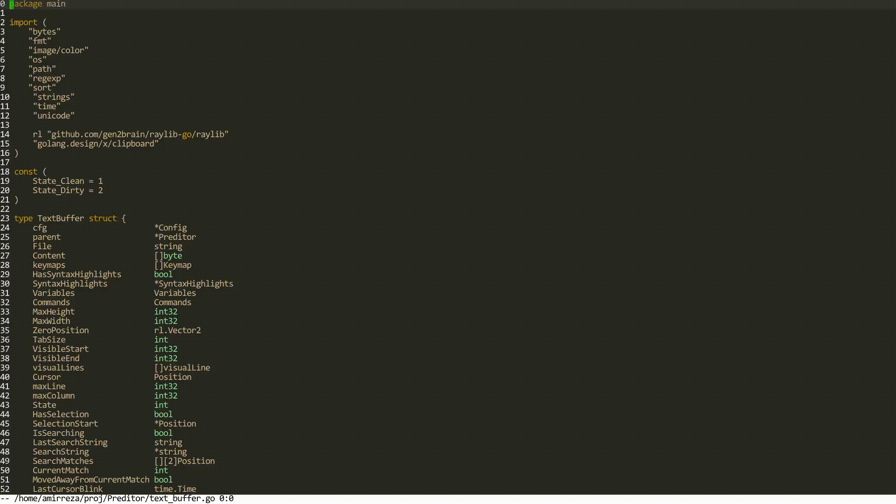
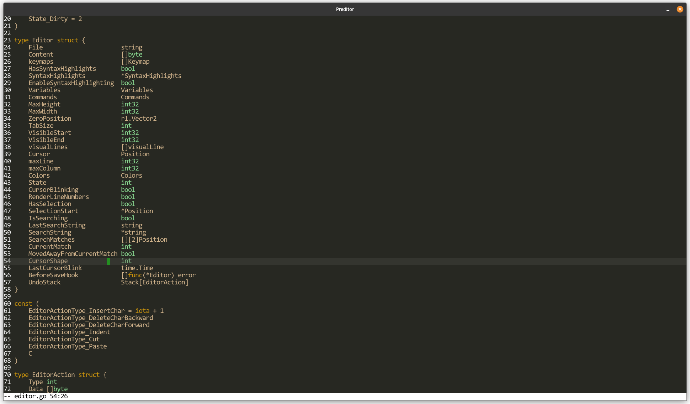
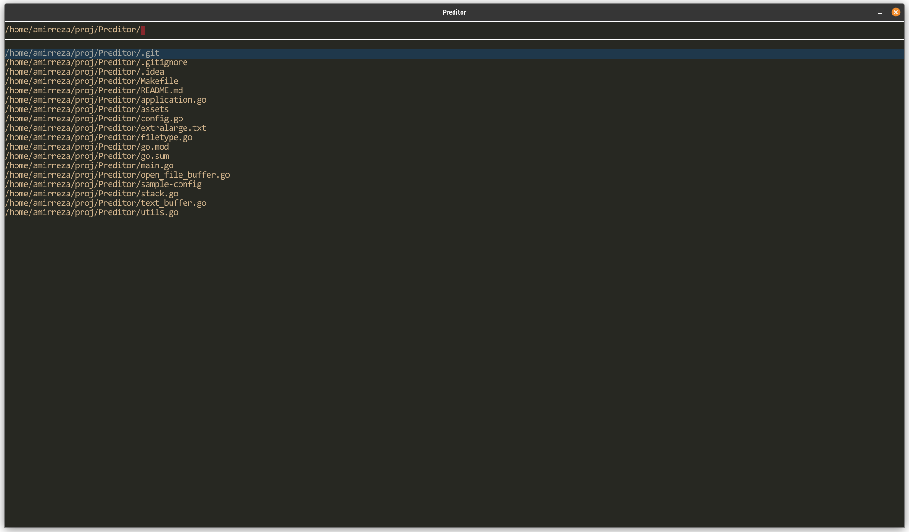

# Preditor
## Programmable Editor
Simple text editor implemented in Golang using Raylib with the goal of replacing Emacs for me, easier to extend and much faster and better language to work with than Elisp.

## Show case

# Demo

 
## Features
- reading/writing files
- simple keybindings (no key chords yet)
- Scrolling with both mouse and keyboard
- Line numbers
- Statusbar
- Selecting text
- Cut/Copy/Paste
- Incremental Search
- Support BeforeSaveHook to use formatting tools like Go fmt
- Auto format go code using pkg/format
- Basic Regex syntax highlighting for keywords and types.
- Undo
- Open file with glob completion
- switch between open files
- Grep Buffers using Ripgrep ( more backends are possible )

# Design and Terminology

## Buffers
Buffers are things that get rendered on screen and handle key events, they are usually made up by composing multiple components, each one have stack of keymaps
which they use to handle user interactions.

## Components
Components are things that represent a section in UI and have their own state and logics but they don't handle user interactions and are controllable from buffers.

## Keymaps
Mapping from a Key event to a function that handles it, specific to each buffer.

# Screenshot

## TODO:
- Zoom in/out (increase/decrease) font size
- Fuzzy file finder
- Command output buffer ( run a command and see it's result, similar to *Compile Mode* in Emacs)

