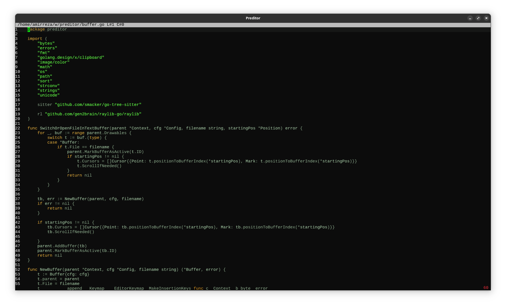
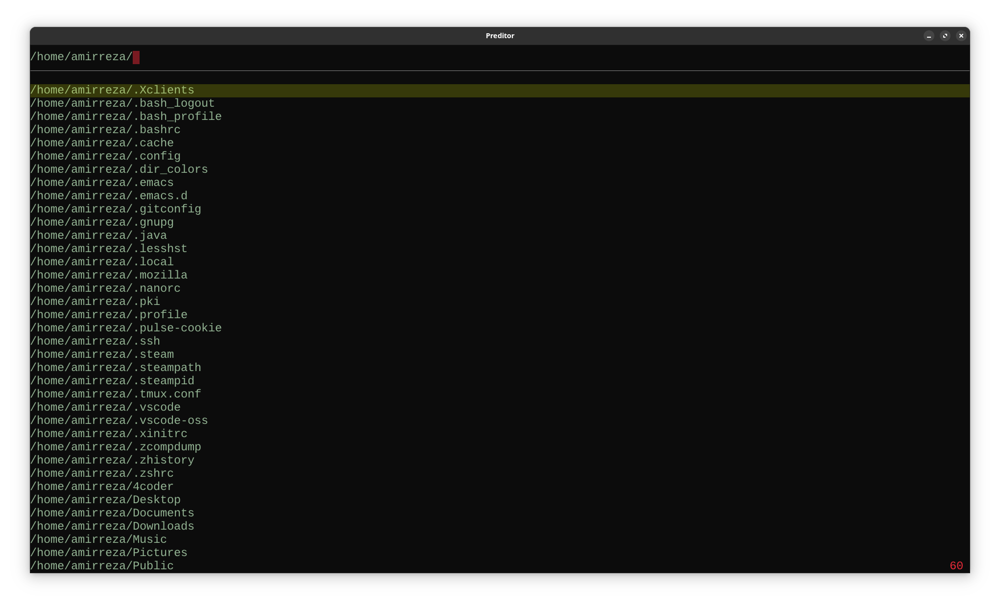
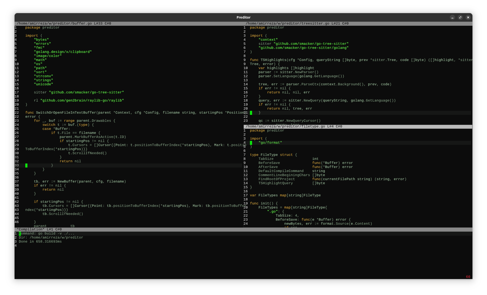
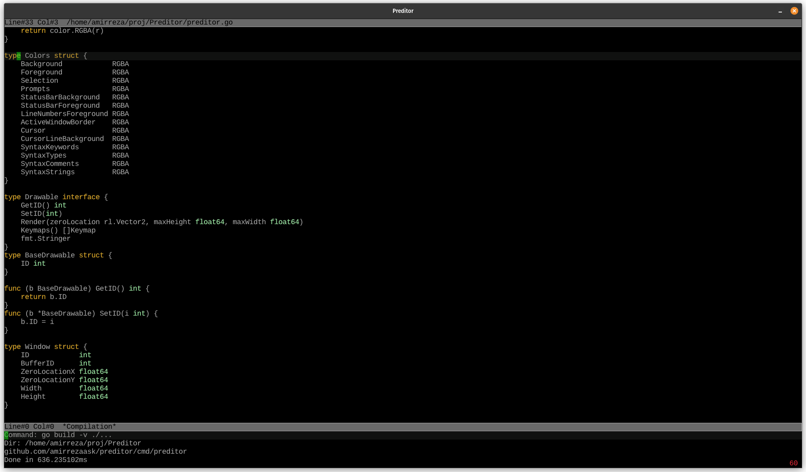
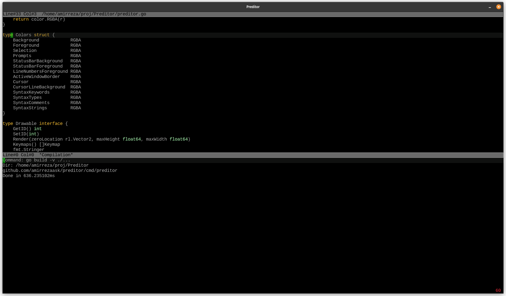

# Preditor
## Programmable Editor
Simple text editor implemented in Golang using Raylib with the goal of replacing Emacs for me, easier to extend and much faster and better language to work with than Elisp.

# Screenshots

#### File Picker

#### Searching text (ripgrep backend)

#### Split windows

#### Build window

## Features
- Treesitter syntax highlighting
- Multi-Cursors (WIP)
- Splits