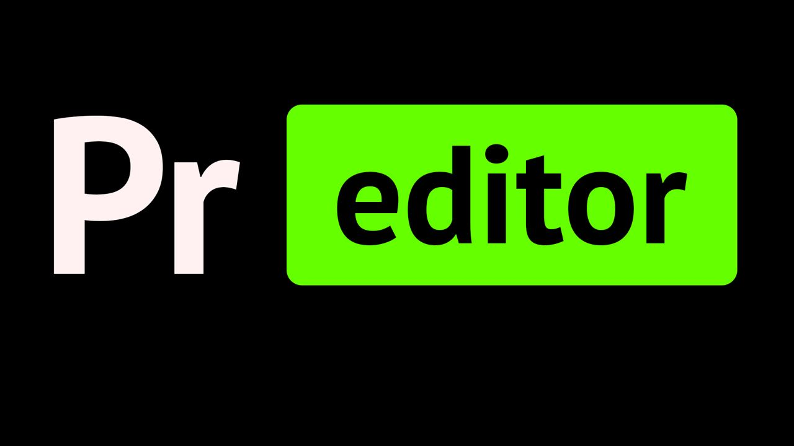

# Preditor

## Programmable Editor
Simple text editor implemented in Golang using Raylib with the goal of replacing Emacs for me, easier to extend and much faster and better language to work with than Elisp.

# Screenshots

#### File Picker

#### Searching text (ripgrep backend)

#### Split windows

#### Build window

## Credits
- Allen Webster for 4coder editor which I took the default colorscheme and basic idea of having an editor that is extensible with an "actual" language.
- Casey Muratori for handmadehero which I learnt a lot
- Jonathan Blow for his inspiring character
- Emacs/VSCode/Neovim which I took ideas from
- Raylib for being an awesome yet simple graphics library